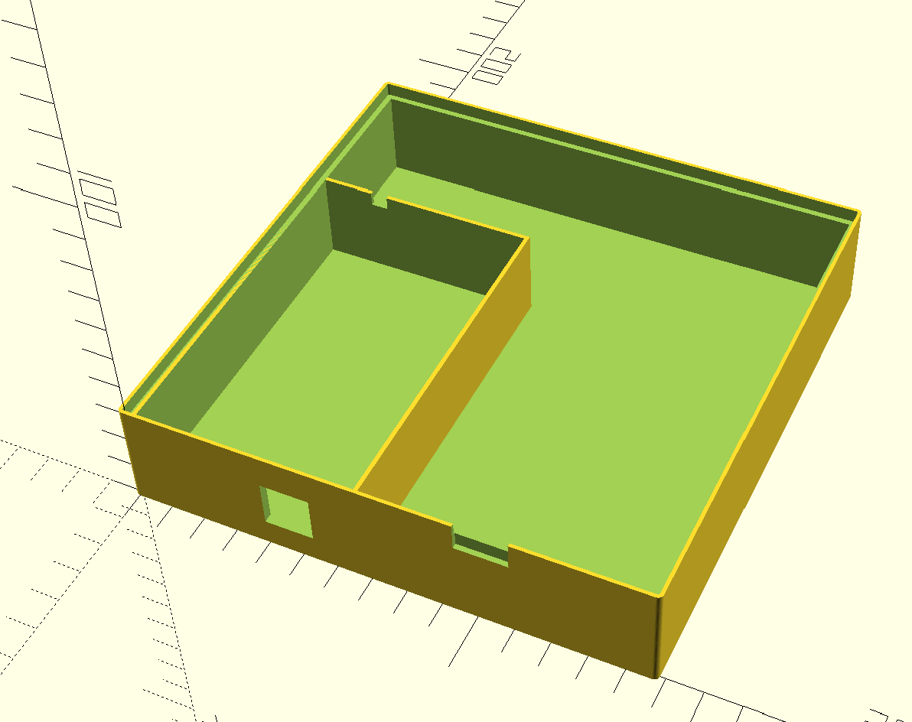

# TL 866 II Plus Box

Based on [TL 866II Plus box by Arminth](https://www.thingiverse.com/thing:4936082),
shrunk down to fit on my Adventurer 3 printer (15x15cm).

The slot for the reader's ZIF lever, the DIP slots and separating wall removals
are all optional, but I would recommend them for printing this small a case.

More info on [Twitter](https://twitter.com/Micro_Repairs/status/1484442264080461831?s=20).